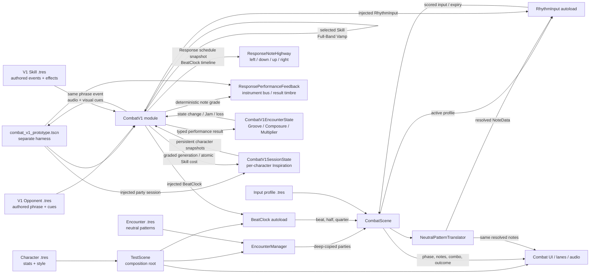
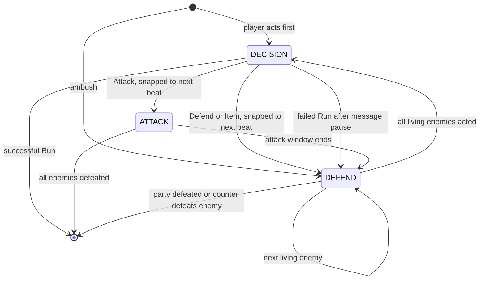

# Architecture

This document describes the **current implementation**, including the legacy
HP/damage and `ATTACK`/`DEFEND`/`DECISION` model. It is not the target combat
design. Use [Combat System v1](combat/COMBAT_SPEC_V1.md) for intended behavior and
the [reconciliation ledger](combat/reconciliation-v1.md) for migration status.

## Current Architecture

The repository is a single local Godot 4.6 project. `test_scene.tscn` is both the
configured main scene and the prototype composition root. It loads character and
encounter Resources, starts audio and the global beat clock, instantiates combat,
selects the active input profile, and wires the UI/feedback scenes.

There is no client/server split, database, authentication, external service,
background worker, durable save system, production export configuration, or
deployment architecture. The isolated Wwise spike export preset described below
is technical evidence rather than a production game export.

`combat_v1/` is an isolated Combat V1 cadence and encounter-state module, and
`combat_v1/combat_v1_prototype.tscn` is a separately runnable harness for it.
The harness injects the existing `BeatClock` and `RhythmInput` autoloads into
`CombatV1`; it does not replace the configured `test_scene.tscn` or its legacy
combat flow. `CombatV1` owns a deterministic `CombatV1EncounterState`, observes
an injected `CombatV1SessionState`, and exposes cadence plus encounter-wide
Groove, Composure, Multiplier, character-owned session Inspiration, and terminal
outcomes through one public seam. It also plays a deep-copied V1 `OpponentData` phrase from
audio-corrected beat/sub-beat signals and emits one event seam carrying the
authored cue plus the actions already mapped by the prepared Response schedule.
Audio, text, and transient lane-preview presentation all consume that seam.
Response adds a snapshot-first schedule with stable target identity,
mapped action, authored offset, an input-free handoff, independently configured
approach lead and scoreable due time, and current BeatClock-derived timeline
position. A separate diagnostic `CombatV1HUD` consumes only that public
state and signal surface, including snapshot-first setup for signals emitted before
it connects, and hosts a rhythm-language-aware `ResponseNoteHighway`. After each non-terminal
Response, an indefinite Tactical Vamp presents authored Skills with their
Inspiration costs and current affordability. Confirming an affordable Skill
spends its character-owned cost atomically, holds a full four-beat count-in, and
runs that Skill's multi-bar Character Performance. The harness repeats Tactical
Vamp and Character Performance once for each member in fixed authored order, then
inserts one input-free Full-Band Vamp bar before the next Enemy Phrase without
repeating Settle. Public
state and a transition signal expose the pending count-in and its
BeatClock-derived progress so the HUD can present a four-step listening display.
The prototype runs Luthier followed by Beatrice once per exchange. Active-member
handoffs replace input profiles, Skill loadouts, Inspiration ownership,
instrument/presentation identity, evaluator metadata, and transient notes without
restarting the shared timing or music. This fixed order and two-performance count
remain provisional pending playtesting; runtime reorder, availability, final
loadout rules, and opponent preferences remain unimplemented.

### Isolated Wwise spike infrastructure

`spikes/wwise/` is isolated technical-spike infrastructure, not part of the normal
Combat V1 composition. The configured legacy scene and standalone Combat V1
harness still use the `BeatClock` autoload and native Godot audio. The spike's
`WwiseMusicAdapter` demonstrates a second implementation of the same musical-time
surface: continuous position plus recovered whole-, half-, and quarter-beat
boundaries. `WwiseRuntimeBridge` contains the direct Wwise engine calls and
lifecycle operations. The adapter owns Wwise-shaped playing/callback
observations only long enough to normalize them into the repository timing
surface; those details do not cross the isolated adapter boundary.

ADR-010 selects that adapter direction for #21 after the #20 Phase B gate, but the
production-facing arrangement-intent interface and real-combat integration do not
exist yet. Combat should emit repository-owned intent; a future adapter may map it
to Wwise while native audio remains the rollback path. Wwise callbacks may inform
presentation and diagnostics, but continuous extrapolated position remains the
timing authority and callbacks must not become a scoring dependency.

## Major Modules

| Module | Responsibility |
|---|---|
| `autoloads/beat_clock.gd` | Converts audio playback into beat/sub-beat signals and timing offsets |
| `autoloads/rhythm_input.gd` | Maps inputs through the active profile, detects chords, scores timing, and expires notes |
| `autoloads/debug_log.gd` | Static, category-gated event logging utility |
| `combat/combat_scene.gd` | Owns combat phases, action resolution, damage, enemy turns, limit gauge, and outcomes |
| `combat/encounter_manager.gd` | Instantiates combat and deep-copies Resource-backed enemy parties |
| `combat/*_evaluator.gd` | Character-specific attack damage/coherence behind `AttackEvaluator` |
| `combat/neutral_pattern_translator.gd` | Resolves neutral enemy hits into deterministic directional or percussive notes |
| `combat/combat_ui.gd` and lane scripts | Present state and note approaches through combat signals |
| `combat_v1/combat_v1.gd` | Isolated Combat V1 seam; owns the repeatable Settle-free conversation cadence plus `CombatV1EncounterState`, binds injected per-character session progression, schedules an authored opponent phrase and its Response, spends affordable Skill costs atomically, runs Character Performance and one-bar Full-Band handoff, and exposes count-in progress, snapshot-first presentation, Inspiration, and terminal signals |
| `combat_v1/encounter_state.gd` | Deterministic Issue #10 state module; owns configurable Groove, shared Composure, shared Multiplier math, clamping, and one-shot Jam/loss resolution |
| `combat_v1/session_state.gd` | Encounter-independent party progression owner; maintains individually configured Inspiration bounds and generation, atomic floor-protected costs, stable character snapshots, and guarded change notifications |
| `combat_v1/opponent_data.gd`, `opponent_phrase.gd`, and `phrase_event.gd` | V1 authoring model for opponent identity, one-to-four-bar phrases, musical offsets, one-to-four-input Response cues, and symbolic audio/visual cues; it has no legacy enemy statistics |
| `combat_v1/opponents/drum_golem.tres` | One-bar prototype opponent phrase with whole-, half-, and quarter-beat events |
| `combat_v1/skill.gd`, `skill_event.gd`, and `skill_effect.gd` | Minimal Skill authoring boundary for player-facing purpose, Inspiration cost, configurable bar duration, timed one-to-four-action events, and ordered effect adapters; concrete effects apply through encounter-state methods without Skill-specific orchestrator branches |
| `combat_v1/party_member.gd` and `combat_v1/party/*.tres` | Ordered V1 party authoring seam for character identity, input profile, rhythm/presentation language, instrument style, and Skill list; live members explicitly copy externally referenced nested Resources |
| `combat_v1/skills/*.tres` | Two Luthier melodic/harmonic Skills plus two Beatrice percussive Skills with distinct authored schedules and provisional costs/effects |
| `combat_v1/response_note_highway.tscn` and `combat_v1/response_note_highway.gd` | Active-language presentation adapter; uses four travelling directional lanes for Luthier and two spatial closing-circle targets for Beatrice, whose large approach rings carry color-accented `1 e & a` subdivision markers, while retaining grouped cues, snapshot-first BeatClock timing, and lane-local result truth |
| `combat_v1/response_performance_feedback.tscn` and `combat_v1/response_performance_feedback.gd` | Replaceable performance-audio adapter; plays mapped phrase/results as Luthier plucks or Beatrice drum transients on the active instrument bus, softens or mutes imperfect grades, and never observes BeatClock or changes backing playback |
| `combat_v1/combat_v1_hud.tscn` and `combat_v1/combat_v1_hud.gd` | Diagnostic V1 presentation for cadence, active character/instrument identity, visible Skill choices/costs/affordability, committed count-in progress, Groove, Composure, Multiplier, character-specific Inspiration, phrase cues, six-grade feedback, nonviolent outcomes, and backing track; observes only the public `CombatV1` seam |
| `combat_v1/combat_v1_prototype.tscn` and `combat_v1/combat_v1_prototype.gd` | Separately runnable harness that owns/injects fixed-order Luthier/Beatrice party progression and dependencies, owns symbolic phrase-audio/log handoffs, and hosts `CombatV1HUD` plus the Response feedback adapter; defaults to Stonebeat, switches procedural backing tracks with keys 1–3 or controller shoulders, submits Response with Start, selects Skills with Up/Down plus controller A, and is not the configured main scene |
| `spikes/wwise/wwise_music_adapter.gd` | Isolated `BeatClock`-compatible timing and arrangement adapter proven by #45; it is not wired into Combat V1 |
| `spikes/wwise/wwise_runtime_bridge.gd` | Replaceable Wwise boundary that owns middleware event, State, callback, and position-query knowledge |
| `characters/*.gd/.tres` | Character stats, input behavior, and musical/visual identity |
| `encounters/*.tres` | Editable encounter groups and neutral enemy patterns |
| `rhythm_engine/` | `NoteData`, `NeutralHit`, and queued `ActiveNote` domain types |

## Combat and Input Data Flow

1. `test_scene.gd` loads a `CharacterData` Resource and immediately calls
   `duplicate(true)` so HP and gauge mutation remain fight-local.
2. `EncounterManager.start_combat_from_definition()` deep-duplicates each enemy,
   instantiates `CombatScene`, and calls `setup()`.
3. `CombatScene.set_active_profile()` selects an attack evaluator and configures
   `RhythmInput` with the profile's action-to-alias map and chord definitions.
4. `BeatClock` emits beat, half-beat, and quarter-beat events from audio-corrected
   playback time.
5. During `DEFEND`, `CombatScene` matches neutral hits at the current phase offset.
   `NeutralPatternTranslator` deterministically resolves each hit for the active
   defense style.
6. The same translation inputs feed note announcement and scoring injection so
   visuals and scoreable notes stay in parity.
7. `RhythmInput` emits `input_scored` or `note_missed`; `CombatScene` applies the
   active phase/evaluator rules and signals UI/audio consumers. The timing grade
   and `note_consumed` are separate facts: a well-timed press only blocks a
   targeted DEFEND note when it actually consumed that note.

## Phase Model

`DECISION` pauses note injection and combat scoring, not `BeatClock` or the backing
track. Normal actions execute on the next beat. A failed run intentionally uses a
short real-time message pause before forced defense.

## Domain Model and Persistence

- `CharacterData`: mutable combat stats, limit-gauge configuration, and `SoloStyle`.
- `CharacterInputProfile`: input map, chord definitions, evaluator key, and defense
  pattern type.
- `SoloStyle`: instrument bus, scale, root note, accent color, and phase copy.
- `EncounterDefinition`: ordered `EnemyData` Resources.
- `EnemyData`: combat stats, phase length, and `Array[NeutralHit]`.
- `NeutralHit`: character-independent `beat_offset` plus `lane_count`.
- `NoteData`: resolved timing, direction alias, and scoring mode.
- `OpponentData`: V1 opponent identity plus an authored `OpponentPhrase`; it does
  not inherit `EnemyData`.
- `OpponentPhrase`: fixed-four-beat-bar duration plus ordered
  `OpponentPhraseEvent` resources.
- `OpponentPhraseEvent`: beat offset, response prompt identity/copy, and symbolic
  audio and visual cue identifiers.
- `CombatV1SessionState`: in-memory, per-character Inspiration configuration and
  balances that survive consecutive encounters owned by the same play session.
- `CombatV1Skill`: player-facing purpose, contribution metadata, Inspiration
  cost, fixed-four-beat bar count, timed interaction events, and ordered effects.
- `CombatV1SkillEvent`: performance beat offset plus one-to-four simultaneous
  input actions.
- `CombatV1SkillEffect`: Resource adapter invoked with encounter state and the
  reduced execution result after Character Performance grading.

`.tres` files are templates. Live character and enemy instances must be deep-copied
before mutation; `CombatV1.setup()` deep-copies its selected V1 opponent and nested
phrase, while `bind_party()` explicitly copies externally referenced profiles,
styles, Skills, events, and effects. Replay selection is passed through static variables in
`test_scene.gd` across `reload_current_scene()`; it resets when the process restarts.
Inspiration persists only while its separately owned `CombatV1SessionState`
remains alive. It does not mutate a gameplay Resource or legacy limit gauge, and
there is no durable persistence.

## Interfaces and Boundaries

- Godot signals are the primary cross-system interface. Consumers must disconnect
  from autoload signals during teardown.
- `AttackEvaluator` is the extension seam for new attack scoring behavior.
- `CharacterInputProfile` plus `NeutralPatternTranslator` is the character/enemy
  compatibility seam.
- `EncounterManager.start_combat_from_definition()` is the preferred encounter
  entry point. The hardcoded-ID path remains for backward compatibility and tests.
- Raw rhythm InputMap action names should remain inside input profiles or
  `RhythmInput`'s default map; downstream systems use direction aliases. The
  project InputMap maps Luthier's directions to arrows, D-pad, and positionally
  matching face buttons, and Beatrice's two drum actions to F/J and left/right
  triggers. Harness-only Start and shoulder actions remain in the harness adapter.
- `CombatV1.player_intent()` accepts `SUBMIT_RESPONSE` during Response. The legacy
  `CONTINUE_ROUND` test seam remains temporarily available, but the runnable V1
  harness no longer exposes it as player flow.
- `CombatV1.bind_party(session_state, party_members)` attaches encounter-
  independent progression plus a fixed authored party before setup. The prior
  `bind_session(session_state, character_id)` remains the single-character seam for
  focused tests. Session snapshots and bounds remain separate from live gameplay
  Resources and encounter-wide state.
- `CombatV1.get_skill_choices()` exposes purpose, interaction, authored Inspiration
  cost, and affordability. `select_skill(skill_id)` spends the active character's
  cost atomically, commits one authored Skill, queues the full four-beat count-in,
  and rejects unaffordable, duplicate, or out-of-cadence selection.
- `CombatV1.get_character_performance_presentation()` is the snapshot-first Skill
  schedule seam. It exposes selected Skill identity, duration, stable target/group
  identity, expected actions, authored offsets, and the audio-corrected performance
  timeline without exposing the mutable runtime target array.
- `character_performance_note_graded` and `character_performance_completed` publish
  the same six-level note and phrase truth used by Response. The highway, HUD, and
  performance-audio adapter consume those signals without owning grading rules.
- `CombatV1SkillEffect.apply(encounter_state, execution)` is the Skill-effect seam.
  `CombatV1` invokes configured effects in authored order and contains no branch on
  Skill identity or effect implementation. Concrete adapters route into the
  existing performance-result state operation or focused operations such as
  bounded Composure restoration.
- `CombatV1.apply_performance_result(execution, effectiveness)` is the V1 state
  seam. Its enum inputs keep execution quality distinct from tactical
  effectiveness; callers do not calculate Multiplier-adjusted Groove.
- `CombatV1.get_state()` exposes the owned encounter snapshot together with
  active-character rhythm/instrument/evaluator identity, Inspiration/bounds,
  ordered party and session snapshots, cadence, and the pending next-round
  count-in's current and total beats.
  `next_round_transition_changed` reports the accepted transition and each
  BeatClock-derived progress step, `encounter_state_changed` reports accepted
  atomic applications, `inspiration_changed` publishes independent character
  snapshots, `active_character_changed` refreshes every presentation adapter, and
  `resolved` carries the typed `JAM` or `LOSS` outcome exactly once.
- `CombatV1.get_response_presentation()` is the complete snapshot-first Response
  presentation seam. While Response is active it exposes stable round-scoped
  target identity, expected action, stable authored-event group identity and size,
  authored beat offset, independently configured handoff and visual lead, their
  combined due beat, whether the handoff is active, and the current audio-corrected
  Response timeline position. That timeline
  is derived from BeatClock's indivisible `musical_position_beats` snapshot, so a
  boundary callback cannot combine a new whole-beat count with the prior frame's
  fractional position. Presentation adapters do not read `_response_targets` or
  reconstruct action mapping.
- `CombatV1.setup()` accepts an authored V1 opponent and a Settle length in bars.
  Enemy Phrase duration comes from that opponent's phrase rather than a parallel
  timing argument.
- `phrase_event_announced` is the single presentation seam for an authored phrase
  event. Audio, text, and highway consumers receive the same live deep-copy event
  plus its active-profile actions read from the already-prepared Response targets;
  callers do not reconstruct mapping. Round-local event identity prevents a
  recovered subdivision from announcing the same event twice.
- `CombatV1ResponseGrader` is the deterministic Response execution seam. A copied
  `Config` defines the five timing boundaries and phrase thresholds; `grade_note()`
  returns one of six typed grades and `summarize()` returns an ordered, immutable-
  by-convention phrase result with per-grade counts.
- `response_target_announced`, `response_note_graded`, and
  `response_phrase_graded` expose Response presentation and execution without
  making the diagnostic harness an owner of grading rules. Each note result keeps
  target and group identity, expected and actual action, signed timing offset, and
  presentation lane so audio and visual adapters consume one deterministic truth.
- `CombatV1ResponsePerformanceFeedback.setup(combat_v1)` observes only cadence,
  mapped phrase-announcement, and note-result signals. During Enemy Phrase it plays
  the same already-mapped lanes that the highway highlights, including simultaneous
  chord voices, so the player hears the lesson before reproducing it. Four
  independent one-shot players also route Response results; synthesized placeholder
  streams remain adapter-local and replaceable. Cadence changes and guarded teardown
  stop voices and clear round-local routing.
- `CombatV1HUD.setup(combat_v1)` connects presentation signals and immediately
  reads `get_state()`, while its owned `ResponseNoteHighway` reads
  `get_response_presentation()`. This reconstructs cadence, all four meters, the
  current count-in progress and Response schedule, the latest phrase summary, and
  a terminal Jam/loss even when their signals preceded UI setup. Both adapters
  guard-disconnect every signal they own during teardown.

## Combat V1 Diagnostic HUD

The standalone harness instances `CombatV1HUD` instead of adapting legacy HP or
limit-bar nodes. Enemy Phrase, Settle, Tactical Vamp, Character Performance, and
Full-Band Vamp have distinct copy and treatments. Tactical Vamp shows both Skill
purposes, interaction summaries, effect summaries, contribution labels, bar
counts, Inspiration costs, and current affordability before confirmation. The HUD
displays Groove, shared Composure, shared Multiplier, and the active character's
Inspiration with their public bounds, translates all six
note and phrase grades into readable feedback, and turns each symbolic phrase
`visual_cue` into an on-screen cue alongside the placeholder audio handoff.
Its central board remains visible during Enemy Phrase and Response. During Enemy
Phrase it flashes each mapped action group briefly as translucent cyan ghost notes
in the same four directional lanes later used by Response; the adapter-local flash
lifetime does not schedule phrase events or enable scoring. During Response the
board shows a fixed hit line and moves each target from the current BeatClock
timeline. Targets from one multi-lane event share a purple connector and
synchronized pulse. Results remain keyed by target identity and render a lane-local
burst, double ring, or missed-note ring/X in addition to text, so two chord
components can display different outcomes without overwriting each other. One
authored event may place one to four notes at the same due beat; the preview,
highway, and secondary text cue all present those actions as one chord.
The playtest control panel also names the active temporary backing loop and shows
the 1–3 comparison controls.

After a Skill is confirmed, the cadence remains internally Tactical Vamp until the
existing full-bar re-entry completes, but the HUD immediately replaces the Skill
menu with `Character Performance Count-In`, listening guidance, and four beat
markers. The markers advance only from `next_round_transition_changed`; no UI
timer exists. The retained legacy Continue test seam instead displays `Next Round
Count-In` before Enemy Phrase. Resolution or teardown clears either transition
display.

Terminal copy frames `JAM` as musical connection and `LOSS` as the band losing
the groove. Player-facing V1 labels intentionally avoid legacy damage semantics.

## Combat V1 Opponent Phrase

Settle uses configurable four-beat bars. At its final boundary, `CombatV1` enters
the input-free Enemy Phrase and schedules the selected `OpponentPhrase` against
the injected `BeatClock`'s `beat`, `half_beat`, and `quarter_beat` signals. The
quarter-beat signal carries its exact `.25` or `.75` subdivision because threshold
recovery can emit before the legacy fractional position updates. BeatClock publishes
the current audio-corrected `musical_position_beats` atomically before those signals
for consumers that need a continuous timeline. No combat timer or wall-clock schedule
is introduced.
Whole, half, and quarter offsets are matched deterministically in authored order,
so headless signal simulation reproduces the same event sequence. Each event is
announced once per round even when BeatClock recovers or repeats a subdivision;
repeated rounds clear that guard with their fresh Response targets.

During Settle, Enemy Phrase, and the opening Response handoff, `CombatV1`
temporarily suppresses timing-grade production at the shared `RhythmInput` seam.
It restores the prior scoring state at the handoff boundary, on another
non-listening cadence, or on teardown without changing the active profile.
Listening and handoff presses therefore cannot consume or grade a scheduled
target. `ResponseNoteHighway` listens to those same announcements and flashes the
mapped Response actions in-place without adding a parallel chart or phrase-event
scheduler. The prototype harness also presents `prompt_text` and logs the event's
symbolic `audio_cue` and `visual_cue`;
production phrase-cue assets remain out of scope. Its three backing loops are
procedural, temporary playtest material rather than a dynamic arrangement pass.

## Combat V1 Response Grading

When Enemy Phrase reaches its authored duration, `CombatV1` enters Response and
publishes the complete target schedule before any target is due. Each phrase event
is mapped cyclically through the stable up/right/down/left direction order supported
by the injected `CharacterInputProfile`; an authored `lane_count` expands one event
into one to four distinct targets at the same due beat. The isolated harness defaults
to Luthier's existing four-direction language. Every target receives a stable
round-scoped ID and a scoreable due beat equal to its authored offset plus the
configured Response handoff and visual lead-in. The handoff defaults to one fixed
four-beat bar and the lead-in defaults to two beats. Both remain independent
playtest-tuning values rather than final cadence or difficulty rules. Targets stay
hidden and input-free throughout the handoff, then receive the complete lead-in.
The handoff boundary is logged once from the same absolute Response timeline.
The prepared targets also supply `phrase_event_announced` with that exact action
list for the earlier listening preview. `response_target_announced` later provides
one secondary text cue with the same complete simultaneous action list. This
mapping is a first reproduction exercise, not a new opponent-preference or
multiple-answer model.

`submit_response_input(action, phrase_position_beats)` is the deterministic input
interface. The live `RhythmInput` adapter calls it with the audio-corrected clock's
current absolute position within Response; headless tests call the same method
directly. `CombatV1ResponseGrader` converts the signed distance from the closest
ungraded target's same published due time into configurable `perfect`, `great`,
`good`, `near_miss`, `miss`, or `major_mistake` results. Grade results repeat the
target ID, action, authored offset, and due beat so presentation/scoring parity is
observable. They also carry the target lane plus stable group identity and size,
allowing feedback adapters to preserve chord membership without reconstructing
timing. When multiple targets share that closest time, the matching action is
selected so chord inputs may arrive in either order. A wrong action is at least a
Miss, and a target still unplayed when Response is submitted becomes a Major Mistake.

Phrase grading uses configurable score thresholds rather than the single worst
note, so later strong notes can recover the summary after an individual mistake.
A separately configurable count of Major Mistakes marks a broken phrase. The
ordered summary is retained in `CombatV1.get_state()`, emitted for presentation,
and mapped to the Issue #10 execution seam: Perfect/Great/Good to `CORRECT`, Near
Miss to `NEAR_MISS`, Miss to `MISTAKE`, and a broken phrase to `MAJOR_MISTAKE`.
Response reproduction currently supplies `EFFECTIVE` tactical effectiveness;
future preferences must change that independent input without rewriting execution
truth or creating a Composure penalty for correct play.

## Combat V1 Skill Selection and Repeated Rounds

A non-terminal Response enters Tactical Vamp while the injected BeatClock,
backing audio in the standalone harness, and dependency subscriptions remain
active. Beat and subdivision signals do not drain encounter state, select a Skill,
or advance the cadence while the player waits. The harness presents the active
member's two authored Skills and commits the highlighted choice only on explicit
input.

An accepted Skill selection atomically spends its authored Inspiration cost and
leaves the module in Tactical Vamp through one complete four-beat count-in.
Unaffordable Skills do not spend or begin the transition. Selection suppresses
scoring and publishes zero-of-four progress immediately, followed by each
authoritative BeatClock step.
The following whole-beat signal starts the selected Skill's two- or three-bar
Character Performance. Inputs are graded against that Skill's authored schedule,
missing targets expire at its duration, and the summary is reduced to the existing
encounter execution vocabulary before each authored effect is applied. A
non-terminal result either activates the next member's indefinite Tactical Vamp
or, after the last member, enters one input-free four-beat Full-Band Vamp. The
vamp's following whole-beat signal resets the first authored member, refreshes
Response targets, starts Enemy Phrase at phrase offset zero, and skips the one-time
Settle. Groove, Composure, and Multiplier remain
encounter-wide across rounds, and the module reuses its existing BeatClock and
RhythmInput subscriptions. A Jam, loss, or teardown clears pending transition
state; terminal resolution rejects combat intents and state results.

The harness runs Luthier and Beatrice once each in fixed authored order, with an
indefinite Tactical Vamp and a full count-in before each performance. One
Full-Band Vamp follows the second member. These are provisional playtest choices;
see the [issue #18 prototype record](combat/party-performance-prototype.md) for
the exact scope and unresolved ordering/cadence questions.

## Combat V1 Session Inspiration

`CombatV1SessionState` is a deterministic, in-memory owner of character
progression. The harness keeps its session outside the encounter module and calls
`CombatV1.bind_party(session, party_members)` before setup. Every
registered character receives independently copied bounds, initial balance, and
Good/Great/Perfect note and phrase generation values. Starting a new encounter
with the same session preserves those balances while encounter-wide Groove,
Composure, and Multiplier reset.

`CombatV1` routes accepted Response and Character Performance grades to the
active character's session record. Authored Skill costs are checked and spent
atomically before the committed count-in; rejected selections cannot cross the
configured minimum floor. The public state includes the active character's
Inspiration/bounds and independently copied party snapshots, while
`inspiration_changed` publishes character changes to presentation consumers.
The session never aliases legacy character HP, a limit gauge, a mutable gameplay
Resource, or encounter-wide Multiplier.

The playable harness switches between Luthier and Beatrice while retaining their
independent session balances. Runtime reordering, availability changes,
cross-character support effects, durable save files, final rates, and a separate
Finale/Limit resource remain outside this slice. See the
[Inspiration prototype record](combat/inspiration-prototype.md) for provisional
values and authoring details.

## Combat V1 Encounter State

`CombatV1EncounterState` is an in-process, deterministic module. It does not
observe input, UI, audio, timing windows, legacy evaluators, or legacy HP. For an
accepted atomic performance result it calculates Groove using the pre-result
Multiplier, applies execution-driven Composure and Multiplier changes, clamps all
three values, then evaluates terminal conditions. `CombatV1` owns the instance and
transitions cadence to `RESOLUTION` when the state resolves.

The current defaults are provisional tuning values, all supplied through
`CombatV1EncounterState.Config`: Groove and Composure maxima `100`, Multiplier
minimum/baseline/maximum `1/1/4`, Jam threshold `100`, correct Groove `10`, Near
Miss Groove `2`, Near Miss Composure loss `5`, mistake Composure loss `15`, major
mistake Composure loss `30`, correct Multiplier gain `0.5`, and mistake Multiplier
loss `0.5`. Tactically ineffective play currently scales Groove to zero by
default without changing the execution-driven effects. A major mistake removes
Multiplier above baseline without increasing an already-below-baseline value.

If one atomic result reaches both the Jam threshold and zero Composure, the
provisional Issue #10 policy is that Jam wins. This was explicitly selected by the
product owner during implementation; it is encoded as a named policy branch and
covered by the focused state test. State applications and terminal resolution log
through `DebugLog.combat` as `[STATE  ]` and `[RESULT ]` events.

## Testing Architecture

Tests are standalone `SceneTree` scripts under `test/`. Each engine process loads
the project/autoloads, runs assertions, prints `PASS`/`FAIL`, prints
`=== done ===`, and calls `quit()`. Process exit codes alone are not trustworthy;
verification must also reject engine diagnostics and missing completion markers.
See [DEVELOPMENT.md](DEVELOPMENT.md) and [AGENTS.md](../AGENTS.md).

## Planned Architecture

No target architecture has been accepted for Combat System v1. Design it through
scoped prototype slices rather than projecting the current phase graph and damage
model forward.

Historical planning documents propose the following after combat is validated:

- `AudioDirector`: persistent, beat-locked stem transitions.
- `WorldState`: the single owner of party, encounter progress, area, and save data.
- Overworld, encounter-zone, dungeon, musical-puzzle, and boss scenes that consume
  `BeatClock` without adding game logic to the clock itself.

These modules do not exist. Treat the historical plan as design input, not current
API: [Song of the Stars development plan](superpowers/plans/2026-05-26-song-of-the-stars.md).
