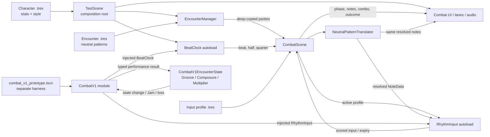
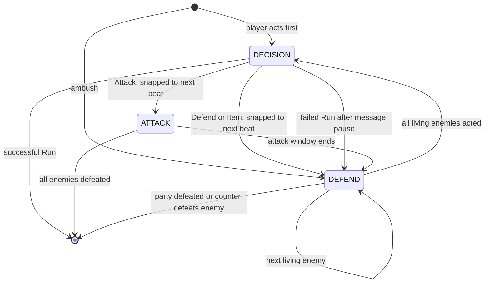

# Architecture

This document describes the **current implementation**, including the legacy
HP/damage and `ATTACK`/`DEFEND`/`DECISION` model. It is not the target combat
design. Use [Combat System v1](combat/COMBAT_SPEC_V1.md) for intended behavior and
the [reconciliation ledger](combat/reconciliation-v1.md) for migration status.

## Current Architecture

The repository is a single local Godot 4.6 project. `test_scene.tscn` is both the
configured main scene and the prototype composition root. It loads character and
encounter Resources, starts audio and the global beat clock, instantiates combat,
selects the active input profile, and wires the UI/feedback scenes.

There is no client/server split, database, authentication, external service,
background worker, durable save system, export configuration, or deployment
architecture.

`combat_v1/` is an isolated Combat V1 cadence and encounter-state module, and
`combat_v1/combat_v1_prototype.tscn` is a separately runnable harness for it.
The harness injects the existing `BeatClock` and `RhythmInput` autoloads into
`CombatV1`; it does not replace the configured `test_scene.tscn` or its legacy
combat flow. `CombatV1` owns a deterministic `CombatV1EncounterState` and exposes
cadence plus encounter-wide Groove, Composure, Multiplier, and terminal outcomes
through one public seam. V1 authored resources, party ordering, timing-grade
mapping, skills, and opponent preferences remain unimplemented.

## Major Modules

| Module | Responsibility |
|---|---|
| `autoloads/beat_clock.gd` | Converts audio playback into beat/sub-beat signals and timing offsets |
| `autoloads/rhythm_input.gd` | Maps inputs through the active profile, detects chords, scores timing, and expires notes |
| `autoloads/debug_log.gd` | Static, category-gated event logging utility |
| `combat/combat_scene.gd` | Owns combat phases, action resolution, damage, enemy turns, limit gauge, and outcomes |
| `combat/encounter_manager.gd` | Instantiates combat and deep-copies Resource-backed enemy parties |
| `combat/*_evaluator.gd` | Character-specific attack damage/coherence behind `AttackEvaluator` |
| `combat/neutral_pattern_translator.gd` | Resolves neutral enemy hits into deterministic directional or percussive notes |
| `combat/combat_ui.gd` and lane scripts | Present state and note approaches through combat signals |
| `combat_v1/combat_v1.gd` | Isolated Combat V1 seam; owns cadence plus `CombatV1EncounterState`, accepts typed performance results, and exposes combined state and terminal signals |
| `combat_v1/encounter_state.gd` | Deterministic Issue #10 state module; owns configurable Groove, shared Composure, shared Multiplier math, clamping, and one-shot Jam/loss resolution |
| `combat_v1/combat_v1_prototype.tscn` and `combat_v1/combat_v1_prototype.gd` | Separately runnable harness for `CombatV1`; not the configured main scene |
| `characters/*.gd/.tres` | Character stats, input behavior, and musical/visual identity |
| `encounters/*.tres` | Editable encounter groups and neutral enemy patterns |
| `rhythm_engine/` | `NoteData`, `NeutralHit`, and queued `ActiveNote` domain types |

## Combat and Input Data Flow

1. `test_scene.gd` loads a `CharacterData` Resource and immediately calls
   `duplicate(true)` so HP and gauge mutation remain fight-local.
2. `EncounterManager.start_combat_from_definition()` deep-duplicates each enemy,
   instantiates `CombatScene`, and calls `setup()`.
3. `CombatScene.set_active_profile()` selects an attack evaluator and configures
   `RhythmInput` with the profile's action-to-alias map and chord definitions.
4. `BeatClock` emits beat, half-beat, and quarter-beat events from audio-corrected
   playback time.
5. During `DEFEND`, `CombatScene` matches neutral hits at the current phase offset.
   `NeutralPatternTranslator` deterministically resolves each hit for the active
   defense style.
6. The same translation inputs feed note announcement and scoring injection so
   visuals and scoreable notes stay in parity.
7. `RhythmInput` emits `input_scored` or `note_missed`; `CombatScene` applies the
   active phase/evaluator rules and signals UI/audio consumers. The timing grade
   and `note_consumed` are separate facts: a well-timed press only blocks a
   targeted DEFEND note when it actually consumed that note.

## Phase Model

`DECISION` pauses note injection and combat scoring, not `BeatClock` or the backing
track. Normal actions execute on the next beat. A failed run intentionally uses a
short real-time message pause before forced defense.

## Domain Model and Persistence

- `CharacterData`: mutable combat stats, limit-gauge configuration, and `SoloStyle`.
- `CharacterInputProfile`: input map, chord definitions, evaluator key, and defense
  pattern type.
- `SoloStyle`: instrument bus, scale, root note, accent color, and phase copy.
- `EncounterDefinition`: ordered `EnemyData` Resources.
- `EnemyData`: combat stats, phase length, and `Array[NeutralHit]`.
- `NeutralHit`: character-independent `beat_offset` plus `lane_count`.
- `NoteData`: resolved timing, direction alias, and scoring mode.

`.tres` files are templates. Live character and enemy instances must be deep-copied
before mutation. Replay selection is passed through static variables in
`test_scene.gd` across `reload_current_scene()`; it resets when the process restarts.
There is no durable persistence.

## Interfaces and Boundaries

- Godot signals are the primary cross-system interface. Consumers must disconnect
  from autoload signals during teardown.
- `AttackEvaluator` is the extension seam for new attack scoring behavior.
- `CharacterInputProfile` plus `NeutralPatternTranslator` is the character/enemy
  compatibility seam.
- `EncounterManager.start_combat_from_definition()` is the preferred encounter
  entry point. The hardcoded-ID path remains for backward compatibility and tests.
- Raw InputMap action names should remain inside input profiles or
  `RhythmInput`'s default map; downstream systems use direction aliases.
- `CombatV1.apply_performance_result(execution, effectiveness)` is the V1 state
  seam. Its enum inputs keep execution quality distinct from tactical
  effectiveness; callers do not calculate Multiplier-adjusted Groove.
- `CombatV1.get_state()` exposes the owned encounter snapshot together with
  cadence. `encounter_state_changed` reports accepted atomic applications and
  `resolved` carries the typed `JAM` or `LOSS` outcome exactly once.

## Combat V1 Encounter State

`CombatV1EncounterState` is an in-process, deterministic module. It does not
observe input, UI, audio, timing windows, legacy evaluators, or legacy HP. For an
accepted atomic performance result it calculates Groove using the pre-result
Multiplier, applies execution-driven Composure and Multiplier changes, clamps all
three values, then evaluates terminal conditions. `CombatV1` owns the instance and
transitions cadence to `RESOLUTION` when the state resolves.

The current defaults are provisional tuning values, all supplied through
`CombatV1EncounterState.Config`: Groove and Composure maxima `100`, Multiplier
minimum/baseline/maximum `1/1/4`, Jam threshold `100`, correct Groove `10`, Near
Miss Groove `2`, Near Miss Composure loss `5`, mistake Composure loss `15`, major
mistake Composure loss `30`, correct Multiplier gain `0.5`, and mistake Multiplier
loss `0.5`. Tactically ineffective play currently scales Groove to zero by
default without changing the execution-driven effects. A major mistake removes
Multiplier above baseline without increasing an already-below-baseline value.

If one atomic result reaches both the Jam threshold and zero Composure, the
provisional Issue #10 policy is that Jam wins. This was explicitly selected by the
product owner during implementation; it is encoded as a named policy branch and
covered by the focused state test. State applications and terminal resolution log
through `DebugLog.combat` as `[STATE  ]` and `[RESULT ]` events.

## Testing Architecture

Tests are standalone `SceneTree` scripts under `test/`. Each engine process loads
the project/autoloads, runs assertions, prints `PASS`/`FAIL`, prints
`=== done ===`, and calls `quit()`. Process exit codes alone are not trustworthy;
verification must also reject engine diagnostics and missing completion markers.
See [DEVELOPMENT.md](DEVELOPMENT.md) and [AGENTS.md](../AGENTS.md).

## Planned Architecture

No target architecture has been accepted for Combat System v1. Design it through
scoped prototype slices rather than projecting the current phase graph and damage
model forward.

Historical planning documents propose the following after combat is validated:

- `AudioDirector`: persistent, beat-locked stem transitions.
- `WorldState`: the single owner of party, encounter progress, area, and save data.
- Overworld, encounter-zone, dungeon, musical-puzzle, and boss scenes that consume
  `BeatClock` without adding game logic to the clock itself.

These modules do not exist. Treat the historical plan as design input, not current
API: [Song of the Stars development plan](superpowers/plans/2026-05-26-song-of-the-stars.md).
