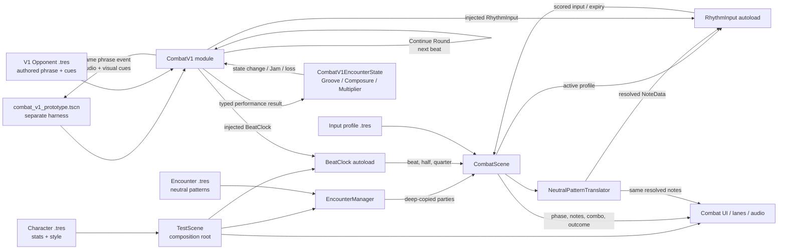
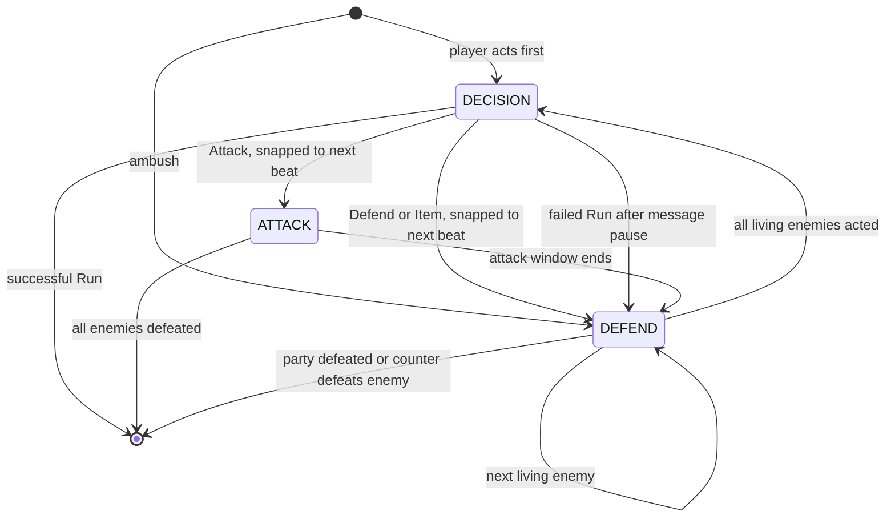

# Architecture

This document describes the **current implementation**, including the legacy
HP/damage and `ATTACK`/`DEFEND`/`DECISION` model. It is not the target combat
design. Use [Combat System v1](combat/COMBAT_SPEC_V1.md) for intended behavior and
the [reconciliation ledger](combat/reconciliation-v1.md) for migration status.

## Current Architecture

The repository is a single local Godot 4.6 project. `test_scene.tscn` is both the
configured main scene and the prototype composition root. It loads character and
encounter Resources, starts audio and the global beat clock, instantiates combat,
selects the active input profile, and wires the UI/feedback scenes.

There is no client/server split, database, authentication, external service,
background worker, durable save system, export configuration, or deployment
architecture.

`combat_v1/` is an isolated Combat V1 cadence and encounter-state module, and
`combat_v1/combat_v1_prototype.tscn` is a separately runnable harness for it.
The harness injects the existing `BeatClock` and `RhythmInput` autoloads into
`CombatV1`; it does not replace the configured `test_scene.tscn` or its legacy
combat flow. `CombatV1` owns a deterministic `CombatV1EncounterState` and exposes
cadence plus encounter-wide Groove, Composure, Multiplier, and terminal outcomes
through one public seam. It also plays a deep-copied V1 `OpponentData` phrase from
audio-corrected beat/sub-beat signals and emits one event seam for audio and visual
presentation. A separate diagnostic `CombatV1HUD` consumes only that public state
and signal surface, including snapshot-first setup for signals emitted before it
connects. After each non-terminal Response, an indefinite Tactical Vamp accepts one
provisional Continue Round intent and begins the next Enemy Phrase on the next
BeatClock beat without repeating Settle. Party ordering, skills, and opponent
preferences remain unimplemented.

## Major Modules

| Module | Responsibility |
|---|---|
| `autoloads/beat_clock.gd` | Converts audio playback into beat/sub-beat signals and timing offsets |
| `autoloads/rhythm_input.gd` | Maps inputs through the active profile, detects chords, scores timing, and expires notes |
| `autoloads/debug_log.gd` | Static, category-gated event logging utility |
| `combat/combat_scene.gd` | Owns combat phases, action resolution, damage, enemy turns, limit gauge, and outcomes |
| `combat/encounter_manager.gd` | Instantiates combat and deep-copies Resource-backed enemy parties |
| `combat/*_evaluator.gd` | Character-specific attack damage/coherence behind `AttackEvaluator` |
| `combat/neutral_pattern_translator.gd` | Resolves neutral enemy hits into deterministic directional or percussive notes |
| `combat/combat_ui.gd` and lane scripts | Present state and note approaches through combat signals |
| `combat_v1/combat_v1.gd` | Isolated Combat V1 seam; owns the repeatable Settle-free conversation cadence plus `CombatV1EncounterState`, schedules an authored opponent phrase, accepts typed intents/results, and exposes combined state, phrase events, and terminal signals |
| `combat_v1/encounter_state.gd` | Deterministic Issue #10 state module; owns configurable Groove, shared Composure, shared Multiplier math, clamping, and one-shot Jam/loss resolution |
| `combat_v1/opponent_data.gd`, `opponent_phrase.gd`, and `phrase_event.gd` | V1 authoring model for opponent identity, one-to-four-bar phrases, musical offsets, response prompts, and symbolic audio/visual cues; it has no legacy enemy statistics |
| `combat_v1/opponents/drum_golem.tres` | One-bar prototype opponent phrase with whole-, half-, and quarter-beat events |
| `combat_v1/combat_v1_hud.tscn` and `combat_v1/combat_v1_hud.gd` | Diagnostic V1 presentation for cadence, Groove, Composure, Multiplier, phrase cues, six-grade note/phrase feedback, nonviolent outcomes, and the active playtest backing track; observes only the public `CombatV1` seam |
| `combat_v1/combat_v1_prototype.tscn` and `combat_v1/combat_v1_prototype.gd` | Separately runnable harness that injects dependencies, owns symbolic phrase-audio/log handoffs, and hosts `CombatV1HUD`; offers three same-length procedural backing loops switchable with keys 1–3 without restarting the clock, and is not the configured main scene |
| `characters/*.gd/.tres` | Character stats, input behavior, and musical/visual identity |
| `encounters/*.tres` | Editable encounter groups and neutral enemy patterns |
| `rhythm_engine/` | `NoteData`, `NeutralHit`, and queued `ActiveNote` domain types |

## Combat and Input Data Flow

1. `test_scene.gd` loads a `CharacterData` Resource and immediately calls
   `duplicate(true)` so HP and gauge mutation remain fight-local.
2. `EncounterManager.start_combat_from_definition()` deep-duplicates each enemy,
   instantiates `CombatScene`, and calls `setup()`.
3. `CombatScene.set_active_profile()` selects an attack evaluator and configures
   `RhythmInput` with the profile's action-to-alias map and chord definitions.
4. `BeatClock` emits beat, half-beat, and quarter-beat events from audio-corrected
   playback time.
5. During `DEFEND`, `CombatScene` matches neutral hits at the current phase offset.
   `NeutralPatternTranslator` deterministically resolves each hit for the active
   defense style.
6. The same translation inputs feed note announcement and scoring injection so
   visuals and scoreable notes stay in parity.
7. `RhythmInput` emits `input_scored` or `note_missed`; `CombatScene` applies the
   active phase/evaluator rules and signals UI/audio consumers. The timing grade
   and `note_consumed` are separate facts: a well-timed press only blocks a
   targeted DEFEND note when it actually consumed that note.

## Phase Model

`DECISION` pauses note injection and combat scoring, not `BeatClock` or the backing
track. Normal actions execute on the next beat. A failed run intentionally uses a
short real-time message pause before forced defense.

## Domain Model and Persistence

- `CharacterData`: mutable combat stats, limit-gauge configuration, and `SoloStyle`.
- `CharacterInputProfile`: input map, chord definitions, evaluator key, and defense
  pattern type.
- `SoloStyle`: instrument bus, scale, root note, accent color, and phase copy.
- `EncounterDefinition`: ordered `EnemyData` Resources.
- `EnemyData`: combat stats, phase length, and `Array[NeutralHit]`.
- `NeutralHit`: character-independent `beat_offset` plus `lane_count`.
- `NoteData`: resolved timing, direction alias, and scoring mode.
- `OpponentData`: V1 opponent identity plus an authored `OpponentPhrase`; it does
  not inherit `EnemyData`.
- `OpponentPhrase`: fixed-four-beat-bar duration plus ordered
  `OpponentPhraseEvent` resources.
- `OpponentPhraseEvent`: beat offset, response prompt identity/copy, and symbolic
  audio and visual cue identifiers.

`.tres` files are templates. Live character and enemy instances must be deep-copied
before mutation; `CombatV1.setup()` deep-copies its selected V1 opponent and nested
phrase. Replay selection is passed through static variables in
`test_scene.gd` across `reload_current_scene()`; it resets when the process restarts.
There is no durable persistence.

## Interfaces and Boundaries

- Godot signals are the primary cross-system interface. Consumers must disconnect
  from autoload signals during teardown.
- `AttackEvaluator` is the extension seam for new attack scoring behavior.
- `CharacterInputProfile` plus `NeutralPatternTranslator` is the character/enemy
  compatibility seam.
- `EncounterManager.start_combat_from_definition()` is the preferred encounter
  entry point. The hardcoded-ID path remains for backward compatibility and tests.
- Raw InputMap action names should remain inside input profiles or
  `RhythmInput`'s default map; downstream systems use direction aliases.
- `CombatV1.player_intent()` currently accepts `SUBMIT_RESPONSE` during Response
  and one provisional `CONTINUE_ROUND` command during Tactical Vamp. Continue
  Round queues exactly one transition to Enemy Phrase on the next BeatClock beat;
  all intents are rejected after terminal Resolution.
- `CombatV1.apply_performance_result(execution, effectiveness)` is the V1 state
  seam. Its enum inputs keep execution quality distinct from tactical
  effectiveness; callers do not calculate Multiplier-adjusted Groove.
- `CombatV1.get_state()` exposes the owned encounter snapshot together with
  cadence. `encounter_state_changed` reports accepted atomic applications and
  `resolved` carries the typed `JAM` or `LOSS` outcome exactly once.
- `CombatV1.setup()` accepts an authored V1 opponent and a Settle length in bars.
  Enemy Phrase duration comes from that opponent's phrase rather than a parallel
  timing argument.
- `phrase_event_announced` is the single presentation seam for an authored phrase
  event. Both audio and visual consumers receive the same live deep-copy event;
  separate scheduling paths would break parity.
- `CombatV1ResponseGrader` is the deterministic Response execution seam. A copied
  `Config` defines the five timing boundaries and phrase thresholds; `grade_note()`
  returns one of six typed grades and `summarize()` returns an ordered, immutable-
  by-convention phrase result with per-grade counts.
- `response_target_announced`, `response_note_graded`, and
  `response_phrase_graded` expose Response presentation and execution without
  making the diagnostic harness an owner of grading rules.
- `CombatV1HUD.setup(combat_v1)` connects presentation signals and immediately
  reads `get_state()`. This reconstructs cadence, all three meters, the latest
  phrase summary, and a terminal Jam/loss even when their signals preceded UI
  setup. `teardown()` guard-disconnects every signal the HUD owns.

## Combat V1 Diagnostic HUD

The standalone harness instances `CombatV1HUD` instead of adapting legacy HP or
limit-bar nodes. Enemy Phrase and Settle use a listening-only label and color;
Response uses a distinct active treatment. The HUD displays Groove, shared
Composure, and shared Multiplier with their public bounds, translates all six
note and phrase grades into readable feedback, and turns each symbolic phrase
`visual_cue` into an on-screen cue alongside the placeholder audio handoff.
The playtest control panel also names the active temporary backing loop and shows
the 1–3 comparison controls.

Terminal copy frames `JAM` as musical connection and `LOSS` as the band losing
the groove. Player-facing V1 labels intentionally avoid legacy damage semantics.

## Combat V1 Opponent Phrase

Settle uses configurable four-beat bars. At its final boundary, `CombatV1` enters
the input-free Enemy Phrase and schedules the selected `OpponentPhrase` against
the injected `BeatClock`'s `beat`, `half_beat`, and `quarter_beat` signals. The
quarter-beat signal carries its exact `.25` or `.75` subdivision because threshold
recovery can emit before the clock's public position updates. This preserves audio
correction in `BeatClock`; no combat timer or wall-clock schedule is introduced.
Whole, half, and quarter offsets are matched deterministically in authored order,
so headless signal simulation reproduces the same event sequence.

During Settle and Enemy Phrase, `CombatV1` temporarily suppresses timing-grade
production at the shared `RhythmInput` seam. It restores the prior scoring state
on Response, another non-listening cadence, or teardown without changing the
active profile. Listening-phase presses therefore emit no scored input, V1 input
observation, or encounter-state result. The prototype harness presents
`prompt_text` and logs the event's symbolic `audio_cue` and `visual_cue`;
production phrase-cue assets remain out of scope. Its three backing loops are
procedural, temporary playtest material rather than a dynamic arrangement pass.

## Combat V1 Response Grading

When Enemy Phrase reaches its authored duration, `CombatV1` enters Response and
replays the same beat offsets through `response_target_announced`. Each phrase
event is mapped cyclically across the unique direction aliases in the injected
`CharacterInputProfile`; the isolated harness defaults to Luthier's existing
four-direction language. This mapping is a first reproduction exercise, not a
new opponent-preference or multiple-answer model.

`submit_response_input(action, phrase_position_beats)` is the deterministic input
interface. The live `RhythmInput` adapter calls it with the audio-corrected clock's
current absolute position within Response; headless tests call the same method
directly. `CombatV1ResponseGrader` converts the signed distance from the closest
ungraded target into configurable `perfect`, `great`, `good`, `near_miss`, `miss`,
or `major_mistake` results. A wrong action is at least a Miss, and a target still
unplayed when Response is submitted becomes a Major Mistake.

Phrase grading uses configurable score thresholds rather than the single worst
note, so later strong notes can recover the summary after an individual mistake.
A separately configurable count of Major Mistakes marks a broken phrase. The
ordered summary is retained in `CombatV1.get_state()`, emitted for presentation,
and mapped to the Issue #10 execution seam: Perfect/Great/Good to `CORRECT`, Near
Miss to `NEAR_MISS`, Miss to `MISTAKE`, and a broken phrase to `MAJOR_MISTAKE`.
Response reproduction currently supplies `EFFECTIVE` tactical effectiveness;
future preferences must change that independent input without rewriting execution
truth or creating a Composure penalty for correct play.

## Combat V1 Tactical Vamp and Repeated Rounds

A non-terminal Response enters Tactical Vamp while the injected BeatClock,
backing audio in the standalone harness, and dependency subscriptions remain
active. Beat and subdivision signals do not drain encounter state or advance the
cadence while the player waits. Skills do not exist yet, so `CONTINUE_ROUND` is
the only provisional Tactical Vamp intent.

An accepted Continue Round intent leaves the module in Tactical Vamp until the
next whole-beat signal. That beat starts Enemy Phrase at phrase offset zero,
refreshes Response targets, and skips the one-time Settle. Groove, Composure, and
Multiplier remain encounter-wide across rounds, and the module reuses its existing
BeatClock and RhythmInput subscriptions. A Jam or loss moves immediately to
Resolution, after which combat intents and state results are rejected.

## Combat V1 Encounter State

`CombatV1EncounterState` is an in-process, deterministic module. It does not
observe input, UI, audio, timing windows, legacy evaluators, or legacy HP. For an
accepted atomic performance result it calculates Groove using the pre-result
Multiplier, applies execution-driven Composure and Multiplier changes, clamps all
three values, then evaluates terminal conditions. `CombatV1` owns the instance and
transitions cadence to `RESOLUTION` when the state resolves.

The current defaults are provisional tuning values, all supplied through
`CombatV1EncounterState.Config`: Groove and Composure maxima `100`, Multiplier
minimum/baseline/maximum `1/1/4`, Jam threshold `100`, correct Groove `10`, Near
Miss Groove `2`, Near Miss Composure loss `5`, mistake Composure loss `15`, major
mistake Composure loss `30`, correct Multiplier gain `0.5`, and mistake Multiplier
loss `0.5`. Tactically ineffective play currently scales Groove to zero by
default without changing the execution-driven effects. A major mistake removes
Multiplier above baseline without increasing an already-below-baseline value.

If one atomic result reaches both the Jam threshold and zero Composure, the
provisional Issue #10 policy is that Jam wins. This was explicitly selected by the
product owner during implementation; it is encoded as a named policy branch and
covered by the focused state test. State applications and terminal resolution log
through `DebugLog.combat` as `[STATE  ]` and `[RESULT ]` events.

## Testing Architecture

Tests are standalone `SceneTree` scripts under `test/`. Each engine process loads
the project/autoloads, runs assertions, prints `PASS`/`FAIL`, prints
`=== done ===`, and calls `quit()`. Process exit codes alone are not trustworthy;
verification must also reject engine diagnostics and missing completion markers.
See [DEVELOPMENT.md](DEVELOPMENT.md) and [AGENTS.md](../AGENTS.md).

## Planned Architecture

No target architecture has been accepted for Combat System v1. Design it through
scoped prototype slices rather than projecting the current phase graph and damage
model forward.

Historical planning documents propose the following after combat is validated:

- `AudioDirector`: persistent, beat-locked stem transitions.
- `WorldState`: the single owner of party, encounter progress, area, and save data.
- Overworld, encounter-zone, dungeon, musical-puzzle, and boss scenes that consume
  `BeatClock` without adding game logic to the clock itself.

These modules do not exist. Treat the historical plan as design input, not current
API: [Song of the Stars development plan](superpowers/plans/2026-05-26-song-of-the-stars.md).
